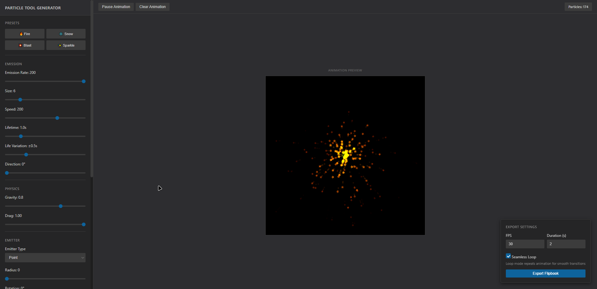

# 🎆 Particle Tool Generator

A particle generator created by me to be used in **Game Projects**. With this tool you will be able to export Flipbooks of each frame that the particle emmited into a PNG Image.



## ✨ Features

- Ready-to-use presets for faster setup;
- Highly customizable configuration;
- Open-source and easy to maintain;
- Export your flipbooks;

## 💻 Languages

- HTML
- CSS
- JavaScript
- Vite

## 🔗 Getting started

1. Clone the repository
```bash
git clone https://github.com/WillSantos08/particle-tool-generator.git
```

2. Install the dependecies
```bash
npm install -g npm
```

3. Go to the folder
```bash
cd particle_tool/
```

4. Execute the project
```bash
npm run dev
```

5. Access the project
```bash
http://127.0.0.1:5173/
```

## 📁 Project Structure
```
particle_tool/
    ∟ node_modules/
    ∟ public/
        ∟ favicon.png
    ∟ src/
        ∟ main.css
        ∟ main.js
    ∟ index.html
README.md
```

## 👤 Author

- William Santos
- GitHub: @WillSantos08
- LinkedIn: https://www.linkedin.com/in/williamsantos08/